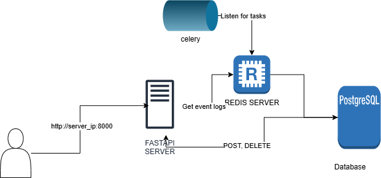
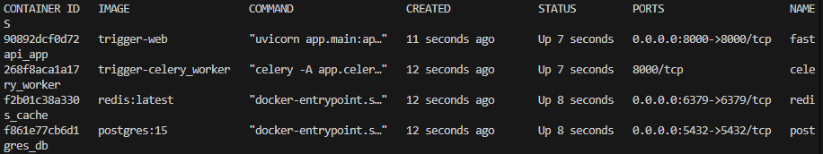

## Architecture:


## Deployed Solution Link
--- Add Link Here -----

## Local Setup 

1. git clone https://github.com/tilakvignesh/Event-Trigger.git
2. Ensure you have docker installed.
3. run ``` docker-compose up --build -d ```
4. Verify it's run properly with ``` docker ps -a ```



5. If everything seems fine, FastAPI should be running now at http://127.0.0.1:8000
6. You can view and interact with the same at http://127.0.0.1:8000/docs


## Endpoint Structures

- You can view the same details breakdown in http://localhost:8000/docs

### GET /triggers
- Input: None
- Output: Gets all triggers

### POST /triggers

- Input: Trigger payload.
    - Example:
        ``` 
            {
            "name": "string",
            "type": "scheduled",
            "schedule": 0,
            "payload": {
                "additionalProp1": "string",
                "additionalProp2": "string",
                "additionalProp3": "string"
            },
            "recurring": false,
            "test": false
            }
        ```
        - Field Names:
            - name: Name of the trigger
            - type: Can have type either "scheduled" or "api"
            - schedule: In seconds, for scheduled triggers
            - Payload: payload for API triggers
            - recurring: Bool, whether to re-run scheduled triggers or not
            - test: Bool, whether the trigger is a test trigger or not. 
- Output: Database response

   
### POST /triggers/<trigger_id>

- Input: trigger_id and update_dict 

- Output: Message on whether the trigger was updated

### DELETE /triggers/<trigger_id>
- Input: trigger_id
- Output: Delete confirmation message

### POST /triggers/<trigger_id>/execute

- Input: API trigger_id
- Output: Message on execution status

### GET /event-logs
- Input: None
- Output: Get all active event logs

### GET /event-logs/archived
- Input: None
- Output: Get all archived event logs

## Deployed Solution Cost for 30 days:

- Assumption: Calculating without the EC2 instancec free tier.

### Break Down:
    - EC2 t2.micro instance cost for 30 days = 0.0116 * 24 * 30 = $8.352
    - Network costs: Data-out costs
        - Realistically, for this setup it's going to be 0 since we have 100GB/month of free transfer
        - In case our transfer is more than this, we'll start incurring charges. But clearly at that point
        the current architecture would not suffice. 

### TOTAL COST OF RUNNING FOR 30 DAYS WITH THE CURRENT ARCHITECTURE: $8.352

## Bonus Section: What Can Be Improved:
- Short answer: Everything! 

- Add test cases
- Add a logging framework
- Improve caching strategy
- Have user input checks. Also clean user input data.
- Deploy on ECS. Can let AWS handle the image. 

## Credits: Resources that helped me complete this project:

- Software Engineer, Colleague: chatGPT
- Mr Know it all: stackoverflow, medium
- Emotional Support: One Piece